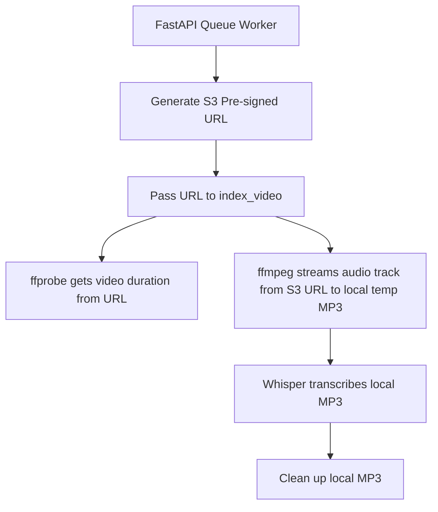

# Implementation Plan: Direct S3 Audio Streaming Extraction (Approach 1)

This implementation plan outlines the specific backend code modifications needed to enable streaming audio extraction directly from S3 pre-signed URLs, eliminating the need to download video files to the backend server.

---

## 1. Affected Files and Architecture Flow



---

## 2. Proposed Changes

### Component 1: S3 Helper Updates
#### [MODIFY] [s3.py](file:///c:/Users/Lenovo/Documents/echochunk-workspace/backend/src/s3.py)
Ensure that the `generate_s3_download_url` function is robust and uses the correct credentials.
* **Logic**: Keep the existing `generate_s3_download_url` function, but verify it returns a valid pre-signed URL with the correct expiration time (e.g. 1 hour/3600 seconds) to allow `ffmpeg` enough time to stream.

---

### Component 2: Extractor Updates
#### [MODIFY] [extractor.py](file:///c:/Users/Lenovo/Documents/echochunk-workspace/backend/src/extractor.py)
Update the helper functions to support both local file paths and HTTP URLs as inputs.

1. **Modify `get_video_duration`**:
   - Skip checking `os.path.exists()` if the path starts with `http://` or `https://`.
   - Pass the URL directly to `ffprobe`. `ffprobe` natively handles HTTP inputs and reads metadata range headers.
   
2. **Modify `extract_audio`**:
   - Skip checking `os.path.exists()` for URLs.
   - For a URL input, generate a local temp audio filename by hashing the S3 key or URL.
   - Invoke `ffmpeg` with the S3 pre-signed URL as the input parameter (`-i`). `ffmpeg` will stream only the audio bytes over the network.
   
* **Code Schema Example**:
```python
def extract_audio(video_path: str) -> str:
    is_url = video_path.startswith("http://") or video_path.startswith("https://")
    
    if not is_url:
        video_path_obj = Path(video_path).resolve()
        if not video_path_obj.exists():
            raise FileNotFoundError(f"Video file not found: {video_path}")
    
    ffmpeg_bin = check_ffmpeg()
    
    # Generate unique output filename
    import hashlib
    path_hash = hashlib.sha256(video_path.encode('utf-8')).hexdigest()[:12]
    audio_filename = f"{path_hash}_extracted.mp3"
    output_path = get_temp_dir() / audio_filename
    
    # ffmpeg streams directly from URL or reads local path
    cmd = [
        ffmpeg_bin, "-y",
        "-i", video_path,
        "-vn",
        "-acodec", "libmp3lame",
        "-ar", "16000",
        "-ac", "1",
        str(output_path)
    ]
    # run subprocess...
```

---

### Component 3: Indexer Updates
#### [MODIFY] [indexer.py](file:///c:/Users/Lenovo/Documents/echochunk-workspace/backend/src/indexer.py)
Update `index_video` to bypass local file checks if the input is a URL.

1. **Modify `index_video`**:
   - Skip the `os.path.exists(abs_path)` check if `video_path` starts with `http`.
   - Ensure duplicate checking (`db.get_video_by_path`) continues to use `s3_key` as the identifier.
   - Pass the URL directly to `get_video_duration` and `extract_audio`.

* **Code Schema Example**:
```python
def index_video(video_path: str, ...):
    is_url = video_path.startswith("http://") or video_path.startswith("https://")
    if not is_url:
        abs_path = os.path.abspath(video_path)
        if not os.path.exists(abs_path):
            raise FileNotFoundError(f"Video file not found: {abs_path}")
    else:
        abs_path = video_path  # Keep URL as is
```

---

### Component 4: Server API & Queue Worker Updates
#### [MODIFY] [server.py](file:///c:/Users/Lenovo/Documents/echochunk-workspace/backend/server.py)
Refactor the S3 download logic inside `run_pipeline_task` to generate a pre-signed URL instead of downloading the video file.

1. **Modify S3 option in `run_pipeline_task`**:
   - Instead of allocating a temp video path and calling `s3_client.download_file(...)`:
     ```python
     # Option A: AWS S3
     if s3_key:
         from src.s3 import generate_s3_download_url
         
         bucket = s3_bucket if s3_bucket else os.getenv("AWS_S3_BUCKET")
         if not bucket:
             raise ValueError("S3 bucket configuration is missing")
             
         # Generate temporary streaming URL (valid for 1 hour)
         video_url = generate_s3_download_url(s3_key, expires_in=3600)
         if not video_url:
             raise ValueError("Failed to generate pre-signed URL for video")
             
         print(f"[Queue Worker] Generated S3 streaming URL. Starting direct extraction...")
         
         index_video(
             video_url, # Pass S3 pre-signed URL instead of local temp file path
             language=language,
             owner_email=owner_email,
             original_filename=os.path.basename(s3_key),
             s3_key=s3_key,
             s3_bucket=bucket,
             playlist_id=playlist_id,
             upload_status="indexing"
         )
     ```

---

## 3. Verification Plan

### Automated Verification
Run the backend test suite (`pytest`) to ensure that:
* Existing local video and GridFS ingestion flows remain intact.
* S3 mock tests verify that `generate_s3_download_url` is called during the S3 pipeline.

### Manual Verification
1. Upload a video file on the deployed application.
2. Monitor backend server logs to verify:
   - No `[Queue Worker] Buffering S3 file...` log is output.
   - `ffmpeg` is invoked directly with the pre-signed HTTP URL as the input.
   - Audio extraction finishes successfully.
   - No temporary video file remains on disk.
